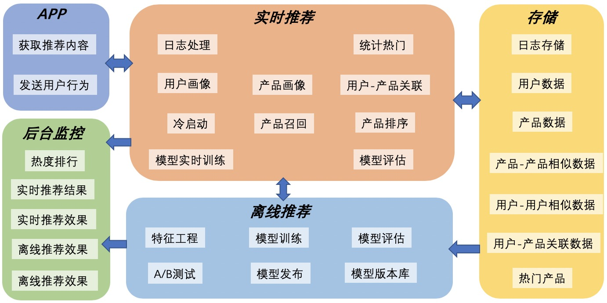
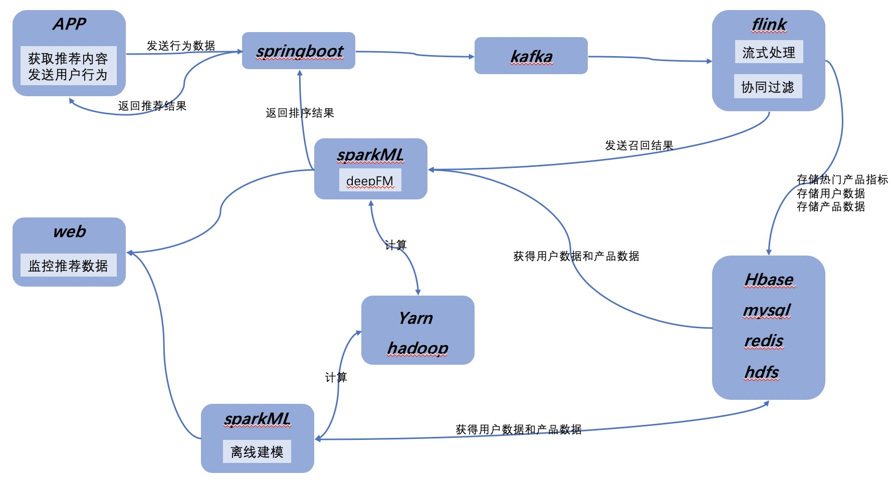

### 中文|[English](./README_EN.md)
# OneOneRecSys
这是一个推荐系统项目。项目的目标是包含常见推荐场景，包括短视频推荐、电影推荐和新闻推荐。当前正在开发短视频推荐。
# 系统架构
**系统架构**

**业务架构**

# 功能说明
**用户特征**
包括
# 讨论
如果对本项目有兴趣或建议，请发送邮件到lingleeabd@126.com
# TODO
* app界面
* springboot接口
# Q&A
* *如果获取用户个人信息？* 
app使用vue编写，不能获取用户的地理位置、年龄、性别等个人信息，所以随机生成用户的这些信息。
* *如何获取短视频？* 
通过爬虫爬取部分短视频作为系统的视频库。
